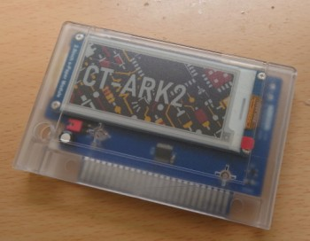
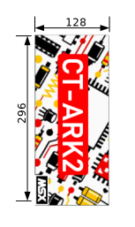
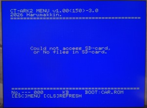
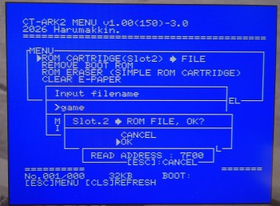
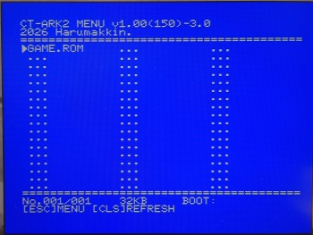
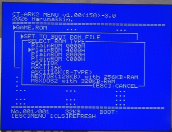

# CT-ARK2
by Harumakkin. 2026/07/02

  
**fig.1 CT-ARK2-03A**

## CT-ARK2って何？
- CT-ARK2は、microSDカードを実装したMSX用ROMカートリッジエミュレータです。
- microSDに保存されたROMイメージを使用し、PlainROM(64KB)、MegaROM（ASCII8K、ASCII16K、ともに3.5MBまで）として動作できます。
- 電子ペーパーがカートリッジラベル代わりになります。microSDカード内の画像ファイルを印刷できます。当然、電源がOFFの状態でも画像は維持されます

## ROMカートリッジエミュレータって何？ 
- ROMカートリッジには通常ROMと呼ばれるメモリ素子が組み込まれていて、その部品にゲームなどのメモリデータ（ソフトウェア）が記録されています。MSX本体にそのカートリッジを挿して電源ONすれば、ROMに記憶されたデータが読みだされてゲームなどを遊ぶことができます。
- ROMには通常一つのデータのみが記録され、そのデータは入れ替えることができないようになっています。
- CT-ARK2では本来のROM部品の代わりにRP2350プロセッサが組み込まれています。
RP2350はmicroSD内のファイルを読みだして、それをROMデータであるかのようにMSX本体に読み込ませます。
ゆえにROMカートリッジエミュレータと呼ばれています。
それだけでは、ROMカートリッジと変わりませんが、
microSD内には複数のファイルを入れておくことができるので、CT-ARK2はひとつのカートリッジで複数のメモリデータを切り替えて使用できるようになっています。
microSD内のファイルのどれをROMメモリデータとして使用するかは、CT-ARK2のメニューモードで選択するすることができます。

## CT-ARK2の特徴
- MSX用ROMカートリッジエミュレータです
- ROMデータファイルをmicroSDカード内に複数入れておくことができます
- カートリッジラベル代わりに電子ペーパーを実装し、microSDカード内の画像ファイルを印刷できます
- ３つの動作モードを持ちます
	- Mode1. メニューモード(ROMファイル選択、ROMへの読み書き、E-Paperの印刷、BASICプログラムファイルをROMイメージファイルへ変換などなど)
	- Mode2. ROMカートリッジモード（ROMの形式は後述）
	- Mode3. マッパーRAM384KBカートリッジ

## 動作環境
- MSX、MSX2、MSX2+、MSXturboRで使用できます。
- ただし、MSXturboRでは、Z80モードのみで動作します。R800モード用に作成されたROMカートリッジのROMデータは正常に扱えません（たぶん動作しません）
- また、MegaROMはASCII8、ASCII16に対応します（ただし3.5MBのサイズまで）
- メニューモード(Mode.1)で使用する場合は、CT-ARK2を必ずスロット１(しかも非拡張スロット)に接続して使用してください。
- ROMカートリッジモード(Mode.2)の場合は、どのスロットで動作するかは選択しているROMイメージの動作環境に従います。
- マッパーRAM384KBカートリッジ（Mode3）の場合はどのスロットでも動作するはずです（MSX2+、turboRで使用した場合、起動時に表示されるRAMサイズが384KB増えているはずです）・

### Mode1. メニューモード
スライドスイッチをMENU側に切り替えて使用するモードです(MENU側：カートリッジ正面から見て右)。CT-ARK2をMSX本体に挿し電源ONすると、CT-ARK2 MENUが起動します
CT-ARK2をMode2(ROMカートリッジモード)で起動させたときに、どのROMイメージファイルで起動するかをこのメニューモードで決定しておきます。以下は各種機能の説明です
**※必ずスロット１(非拡張)にCT-ARK2を接続して使用してください。**
- **ESCキーMENU**
Mode1で起動し、[ESC]キーを押すと表示される機能メニューです。機能は下記のとおりです
	- **ROM CARTRIDGE(Slot2) ➡ FILE**
ROMカートリッジ(32KB)のデータを読み出してmicroSDカード内にファイル保存する機能です。
スロット１にCT-ARK2、Slot2にROMカートリッジを接続しMode1で起動してください。
[ESC]キーを押しメニューから本機能を選択します。
読み出せるデータは、4000h-BFFFH(Page.1-2)の32KB固定です。
保存ファイル名は、保存開始時に8.3形式で入力します。
	- **REMOVE BOOT ROM**
[ESC]キーを押しメニューから本機能を選択します。
Mode2.ROMカートリッジモードで使用されるROMイメージを解除します。解除後は、Mode2で起動してもROMカートリッジとしては起動しません（Mode3.マッパーRAM384KBカートリッジ）として動作します。
	- **ROM ERASER (SIMPLE ROM CARTRIDGE)**
[ESC]キーを押しメニューから本機能を選択します。
[32/64K Simple ROM Cartridge](https://github.com/v9938/MSX_SimpleCartridge) や、RomCart04のデータ消去を行えます。必ずSlot2に接続して使用します。消去方法は２種類あります。Simple ROM Cartridgeが対象の場合、[ALL (CHIP ERASE)]を選択してください。RomCart04の場合カートリッジ全体を消去する場合は、[ALL (CHIP ERASE)]を、選択バンクのみを消去するには[64K (0000-FFFF)]を選択してください
		- **ALL (CHIP ERASE)**
FlushROM全体の消去を行います。
		- **64K (0000-FFFF)"**
FlushROMのうち現在アクセスできる0000h-FFFFhのみを消去します。
	- **CLEAR E-PAPER**
[ESC]キーを押しメニューから本機能を選択します。
表面の電子ペーパー（E-Paper）を白色で塗りつぶします（２０秒ほどかかります）
	- **CHANGE PICO-CPU CLOCK**
[ESC]キーを押しメニューから本機能を選択します。
RP2350マイコンの動作クロックを変更できます。150MHzで通常は使用してください。実験用です
 

- **SDカード内のファイル一覧**
CT-ARK2をMode1で起動すると、microSDカードの \ct-arkフォルダの .ROM、.BAS、拡張子を持つファイルを一覧表示します。ファイル名は、8.3形式で日本語は使用できません（MSXの英数記号のみ）。カーソルキーでファイルを選択できます。カーソルキーが指し示すファイルのサイズが、画面下部にKB単位で表示されます。カーソルキーでファイルを示し田状態で[RETURN]キーを押すと、ファイルを対象とした機能メニューが開きます。機能は下記のとおりです。
	- **SET TO BOOT ROM FILE**
Mode2.(ROMカートリッジモード)でCT-ARK2を起動したときに、microSDカード内のどのファイルを使用してROMカートエミュレーションを行うかを決定します。
CT-ARK2が対応できるROMカートリッジは8種類あり、選択ファイルがどの種類で使用できるか少々ROMカートリッジの知識が必要になります。8種類は下記の通りです。
		- **PlainROM 0000h**
		- **PlainROM 4000h**
		- **PlainROM 8000h**
		- **PlainROM C000h**
ファイルを0000h、4000h、8000h、C000hから配置して動作します。例えば、一般的な32KB ROMファイルの場合はPlainROM 4000hを選択してください。その場合、4000h-BFFFhが使用さえます。
		- **ASCII8K**
		ASCII8KのMegaROMとして動作します。ただし上限は3.5MBまでです（それ以上大きなファイルの場合、先頭3.5MBのみ使用されます）。また、ファイルサイズが384KB以下の場合、RP2350プロセッサは標準クロックである150MHzで動作します。それ以上のサイズの場合、300MHzにオーバークロックして動作するようになっています。ただし、RP2350はオーバークロックでの動作は保証されていません。消費電流はMSXカートリッジ規格内であることは確認していますが、384KBの際zを超える使用の際はそれを承知の上でお願いします。
		- **ASCII16K**
		ASCII8KのMegaROMとして動作します。ただし上限は3.5MBまでです（それ以上大きなファイルの場合、先頭3.5MBのみ使用されます）。RP2350はオーバークロックについては、ASCII8Kと同様です。
		- **ASCII16K(R-TYPE)**
		R-TYPEのROMイメージ専用です。イメージファイルのサイズがちょうど384KBなので、RP2350プロセッサは標準クロック150MHzで動作します。
		- **NEXTOR(128KB) with 256KB-RAM**
		※実装中です、現在、正常動作しません
		- **MSXDOS2 with 320KB-RAM**
		MSX-DOS2 カートリッジとして動作します。当然、MSX-DOS2 カートリッジのROMイメージファイルが必要です。MSX-DOS2カートリッジは内部でスロットが拡張されています（CT-ARK2でも同様のスロット拡張をエミュレートしているため、この機能で使用する場合は、拡張スロットへの接続ではできません）。320KBのマッパーRAMもエミュレートします
	- **PRINT E-PAPER**
microSDカード \ct-ark2 フォルダ内に格納されている .BMPファイルをE-Paperに印刷します（ファイル形式は後述）。.BMPファイルはファイル一覧には表示されません。.BMPファイルは.ROMイメージファイルと同じ名前にしておいてください。例えば、ADNIS.ROM ファイルがある場合、ADNIS.BMPという画像ファイルを用意しておきます。ファイル一覧から ADNIS.ROM をRETURNキーで選択し、メニューからPRINT E-PAPERを選択してください。ADNIS.BMPファイルが印刷されます。
	- **DELETE FILE**
選択したファイルをmicroSDから削除します。
	- **ROM(32KB,Slot2) ➡ ROM FILE**
[ESC]キーメニューの、"ROM CARTRIDGE(Slot2) ➡ FILE"と同じ機能です。
	- **BAS FILE ➡ ROM FILE**
BASICプログラムファイルをROMから起動できるROMイメージファイルを生成します。.BAS ファイルを選択して本機能を使用してください。ただし、DATA分からRAMにマシン語を書き込んで動作するようなBASICプログラムは使用できません。生成されたROMファイルをMode1で動作させるには、**PlainROM 8000h**を選択してください。またROMカートリッジに書き込み場合も、8000hからにしてください。
	- **ROM FILE ➡ Simple ROM(Slot2)**
	選択したROMファイルをSimple ROM Cartridgeや、RomCart04に書き込みます。
	ファイルの書き込み先アドレスを指定します
		- **0000H**
		- **4000H**
		- **8000H**
		- **C000H**

### ROMデータファイルの形式
形式もへったくれもないのですが、ROMの内容をそのままファイルに書き出したものです。32KB ROMカートリッジの場合は、32KBの内容がそのままファイルにしたものです。ヘッダも何もありません。
ASCII8K、ASCII16K用のROMデータファイルもバンクの内容が連続的にバイナリ保存されているだけです。

### .BMPファイルの形式
E-Paperに使用できる.BMPファイルは、横幅128ピクセル、縦幅296ピクセル、24ビット、非圧縮、です。
画像は下図のように時計回りに90°回転させた状態でBMPファイルにしてください。
使用できる色は白、黒、赤、黄の４色です。それ以上使用されている場合は、適当にその４色へ変換されます。
  
**fig.2 E-Paper用BMPファイル**

## CT-ARK2を作る
部品表にある部品の収集、プリント基板の製造、組み立て、ファームウェアの書き込みの作業が必要です。完成品はありません。 PCBを発注できて、表面実装部品をはんだ付けできて、RP2350にu2fファイルを書き込みができる必要があります。
- 部品表（CT-ARK2-03A_partslist.xlsx）
- 回路図（schematic_CT-ARK2-03A.pdf）
- ガーバーデータ(gerber_CT-ARK2-03A.zip)
- microSDカード
- RP2350B ファームウェア ct-ark2.vXX.uf2
- CT-ARK2 MENU プログラム ct-ark2.sys

## CT-ARK2を使う
### まずはmicroSD カードの用意とセットアップ
1. microSDカードを FATかFAT32でフォーマットします（exFAT、NTFSは使用できません）。動作確認済みの容量は32GBです。それ以上は試したことがありませんが、32GBより大きなサイズのカードを使用して使用できなかった場合は、プライマリパーテーションを32GB以下に切り直せば多分使用できるかなと思います。
2. microSDカードのルートに "ct-ark2" フォルダを作成し、そのフォルダに、 ct-ark2.sys ファイルをコピーします
3. microSDカードをCT-ARK2にセットします。

### CT-ARK2をメニューモード（Mode1）で起動する
1. CT-ARK2のスライドスイッチをMENU側に切替えます(MENU側：カートリッジ正面から見て右)
2. CT-ARK2をMSX本体のスロット１に挿し込み、電源を入れます。
3. MENU画面が表示されればmicroSDカードは正しくセットアップされています。
ct-ark2フォルダに.romファイル、.basファイルが無い場合は、
"Could not access SD card, or No files in SD-card."
と表示されます。
MENU画面が表示されずBASICが立ち上がる、MSX2+以降で起動した場合でタイトル画面のRAM容量がいつもより多く表示される場合は、CT-ARK2はMode.3で動作しています。microSDカードの差し込み、ct-ark2フォルダ名、ct-ark2.sys ファイルが正しいか確認してください。

### ROMカートリッジの内容を取り込んでみる
1. MSX本体のスロット１に、スイッチをMENU側に切り替えたCT-ARK2をセットします
2. MSX本体のSlot2にカートリッジ（32KB以下のROMのみ。MegaROMには対応していません）セットします
3. CT-ARK2 MENUが表示されます
4. [ESC]キーを押してメニューを開きます
5. "ROM(32KB,Slot2) ➡ ROM FILE" を選択します
6. ファイル名を入力し、[RETURN]キーを押します(英数8文字。かな、カナ、グラフィック文字は不可）
7. OKを選択すると、Slot2にカートリッジの読み出しとSDカードへのファイル保存が始まります（終了まで約10秒ほどかかります）

8. 終了すると、ファイル一覧に"入力した名称.ROM"がひとつ追加されます。取り込みはここで完了です。

### 取り込んだROMイメージで起動する
1. 追加されたファイルを上下キーで選択し[RETURN]キーを押してメニューを開きます
2. "SET TO BOOT ROM FILE" を選択します
3. "PlainROM 4000h" を選択します

4. 画面右下に、"BOOT:選択したファイル名" が表示されればOKです。
5. モードスイッチを左に切り替えて、本体の電源を入れ直します（リセットではなく、必ず電源を入れ直してください）
6. 取込んだROMイメージでMSXが動作します。
7. 他のROMイメージで起動したい場合は、CT-ARK2 MENUを起動して 1. 操作を再度行います

### BASICプログラムをROMファイル化する
1. 非ASCIIで保存されているBASICプログラムファイル（.BASファイル）を、microSDのct-ark2フォルダに格納します
2. CT-ARK2をMode1で起動します
3. 該当の.BASファイルを選択し、[RETURN]キーを押してメニューを開きます
4. "BAS FILE -> ROM FILE"を選択します。
5. 保存したいファイル名を入力します（既存ファイル名と重複しないよう注意してください）
6. ファイルが生成され、ファイル一覧にファイル名.ROMが追加されます。
7. 祖ファイルを選んで、"SET TO BOOT ROM FILE"、"PlainROM 8000h"を指定します。
8. CT-ARK2をMode2.で起動させます。BASICプログラムが動作します
9. 余禄：BASICプログラムからヘッダ情報を先頭に付加したROMファイルを生成します。16KBまでのサイズに限ります。出来上がったROMファイルは、blueMSX等でもそのまま使用できます。注意点としては8000h-BFFFhはROMとして機能していますので、その領域をRAMとして使用するようなBASICプログラムは動作しません。またCTRL+STOPも機能しません。

### 32/64K Simple ROM Cartridge に書き込む
➡ [32/64K Simple ROM Cartridge](https://github.com/v9938/MSX_SimpleCartridge) 
1. Simple ROM Cartridgeをスロット２に挿し込みます
2. ROMファイルをmicroSDに格納し、Mode1で起動します
3. [ESC]キーンおメニューから、[ROM ERASER] を選びます。
4. [ALL (CHIP ERASE)]を選択して、Simple ROM Cartridge内を消去します（消去は必須）
5. 書き込みたいROMファイルを[RETURN]で選択し、[ROM FILE ➡ Simple ROM(Slot2)]を選択します。
6. ROMファイルにあった書き込み先アドレスを選択します（たいてい32KB ROMファイルなら 40000h)
7. 書き込みが始まり、完了したら電源を落とし、CT-ARK2を取り外します。
8. 電源を再度入れると、Simple ROM Cartridgeに書き込んだソフトウェアが起動するはずです

### RomCart04 に書き込む
➡ Simple ROM Cartridge にはひとつの書き込み領域しか持たないのに対し、RomCart04は８個の書き込み領域を持つROM Cartridgeに書き込んだソフトウェアが起動するはずです。
➡ 対象領域は選択スイッチで０～７まで選択できます（８～１５は、０～７と同じ領域を同じです）
1. RomCart04 本体のスイッチを回して対象領域を選択し、スロット２に挿し込みます
2. ROMファイルをmicroSDに格納し、Mode1で起動します
3. [ESC]キーンおメニューから、[ROM ERASER] を選びます。
4. [64K (0000-FFFF)"]を選択して、RomCart04の対象領域内を消去します（消去は必須）。
注意：[ALL (CHIP ERASE)]を選択した場合は、選択領域に関係なく、すべての領域が消去されます。
5. 書き込みたいROMファイルを[RETURN]で選択し、[ROM FILE ➡ Simple ROM(Slot2)]を選択します。
6. ROMファイルにあった書き込み先アドレスを選択します（たいてい32KB ROMファイルなら 40000h)
7. 書き込みが始まり、完了したら電源を落とし、CT-ARK2を取り外します。
8. 電源を再度入れると、RomCart04に書き込んだソフトウェアが起動するはずです

### 取扱えるファイル個数の上限
現状、CT-ARK2 MENUのファイルを一覧では54個までファイルを表示できます。それより多くのファイルを扱えるよう今後改良していきます。

## LICENSEと利用に関する注意事項
1. CT-ARK2のファームウェアとそのソースコード、回路図データおよび資料ファイルは MIT License で配布されます。ただし、CT-ARK2 は、FatFsを使用しています。FatFsのソースコードの扱いに関してはFatFsのLICENSEに従ってください。
2. 本作品は同人ハードウェア＆ソフトウェアです。本作品の設計およびソフトウェアは品質を保証していません。MSX本体やその周辺機器が故障、破損したとしても自身で責任を負える方のみ本作品をご利用ください。特にハードウェアの製作を伴いますのでリスクがあります。製作の腕に自身のある方のみご利用ください。
3. 本作品の設計資料とソースコードの改変や改造、また、別の作品への利用、商用利用は自由です。ただし、1. 2.の制限を超える利用は各自でその責任と義務を負ってください。

## CT-ARKが使用しているソフトウェア
FatFs
Copyright (C) 20xx, ChaN, all right reserved. http://elm-chan.org/fsw/ff/00index_e.html

