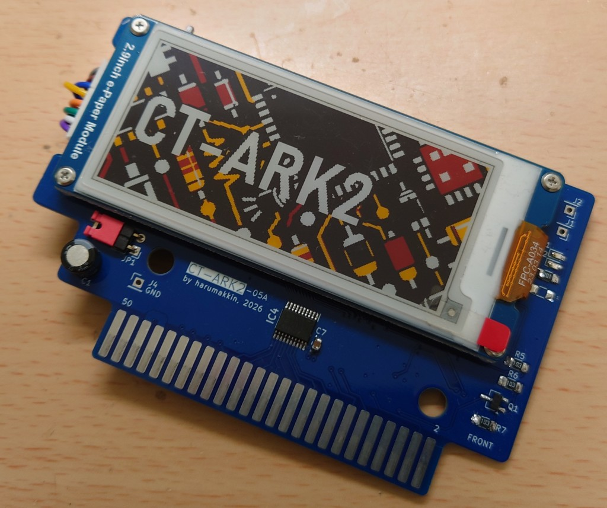
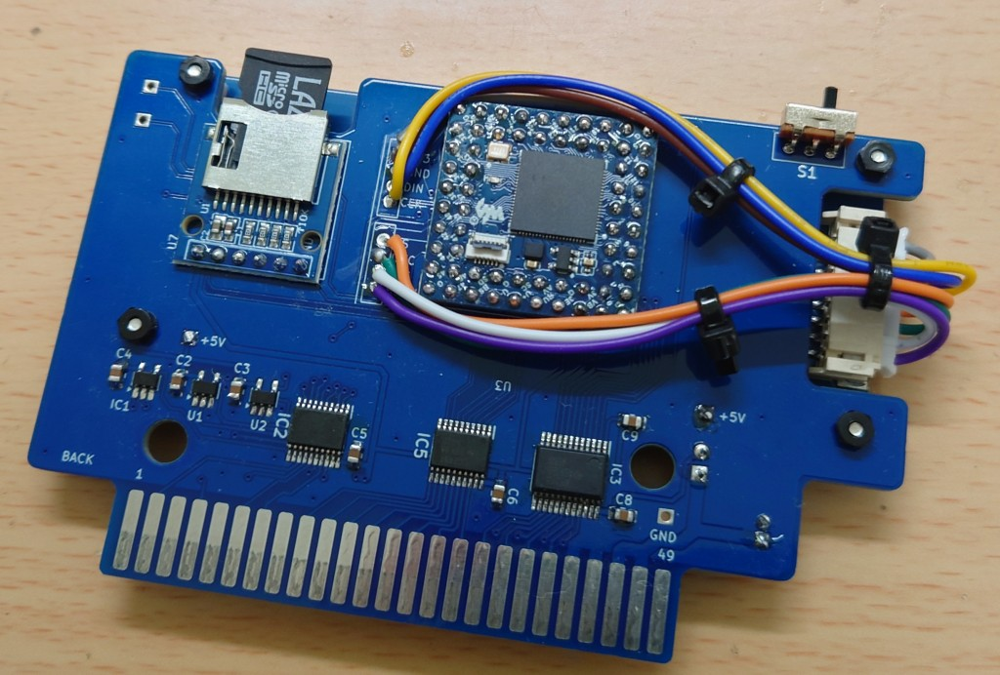
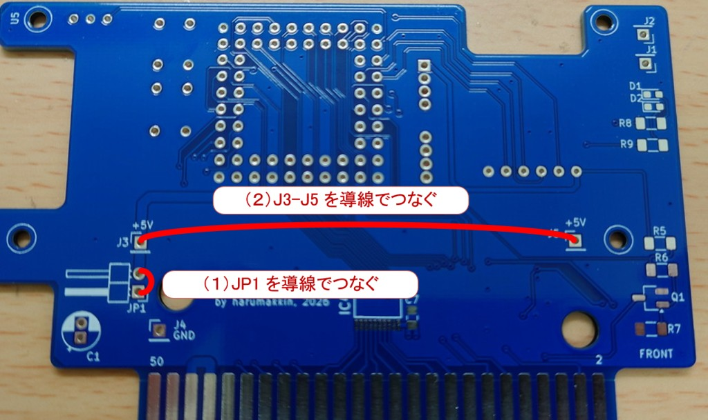

## CT-ARK-06A の組み立てに関しての追加説明

### 1. 組み立て例の写真
組み立て例の写真は下記のとおりです参考まで
  
 

### 2. 追加配線をお願いします

#### (１)JP1を導線で接続してください
写真ではショートピンを使用していますが、導線ではんだ付けしてしまってください
#### (２)J3-J5の間を導線で接続してください
J3-J5間の長さの導線を用意し、接続してください。

以上

